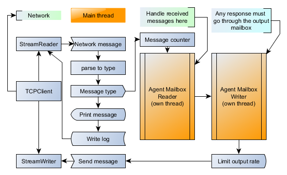
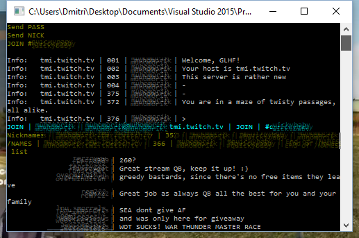

# My little helper #

My little helper in F# for twitch chat api (irc)

Mostly going by [justintv/Twitch-API](https://github.com/justintv/Twitch-API/blob/master/IRC.md) docs.

Sometimes... you need to ba a few hundreds people. And this is a try to figure out a way to do it efficient :smile:

This one is use to collect messages (no nicknames &etc). Those are then used in R to figure things out.

Note to myself:

- Login done using the OAuth token, get it at http://twitchapps.com/.
- Don't push it to GitHub :D

**DateTime.Now** is used internally everywhere.

# Flow #

Everything starts in main thread where command line arguments are read and parsed.

Messages are receive in loop and parsed. Parsed messages are printed and logged in main. Also, it is send to the Reader Mailbox (fire-and-forget).

## Mailbox agents ##

There are two main F# MailboxProcessor agents here. Lightweight mailboxes, runs in own thread asynchronously.

- **ReaderMailbox**. Write handlers here. Handles received messages and Posts replies back via WriterMailbox.
- **WriterMailbox**. Send replies back to twitch. Output rate is limited according to limits.

# Screenshots #

Login

Chat

#  Config #

* Is stored in MyCfg.fs so far. Username and oauth.

## Command line args: ##

* --channel #channel
* --filelog twitch_log.txt

If channel is missing console is going to ask for input.

If the file is missing, the default one is going to be used.

## Uses ##

- Argu. A declarative CLI argument/XML configuration parser for F#
    * [GitHub](https://github.com/fsprojects/Argu) [Tutorial](http://fsprojects.github.io/Argu/tutorial.html)

## TODO ##

- [ ] Config: nickname, oauth login to settings file (or smth)
- [ ] Floating window message/pm counter, avoid bans.
- [ ] TcpClient somehow got in here from examples. Change to HttClient from NuGet.

