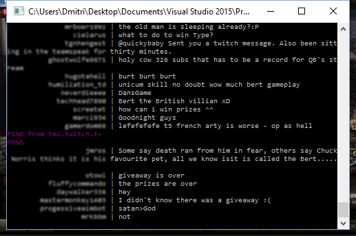

# My little helper #

My little helper in F# for twitch chat api (irc)

Mostly going by [justintv/Twitch-API](https://github.com/justintv/Twitch-API/blob/master/IRC.md) docs.

Sometimes... you need to ba a few hundreds people. And this is a try to figure out a way to do it efficient :smile:

This one is use to collect messages (no nicknames &etc). Those are then used in R to figure things out.

Note to myself:

- Login done using the OAuth token, get it at http://twitchapps.com/.
- Don't push it to GitHub :D

Login

Chat

##  Config ##

* Is storedMyCfg.fs so far. Username and oauth.
* Channel hard-coded.
* Output filename is in Main().

## TODO ##

- [ ] Command line: channel, 
- [ ] Config: nickname, oauth login to settings file (or smth)
- [ ] Output filename as cli parameter.